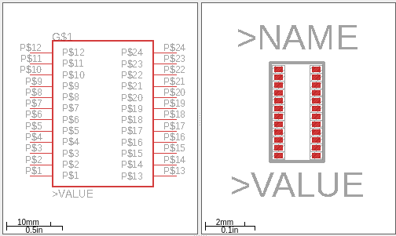
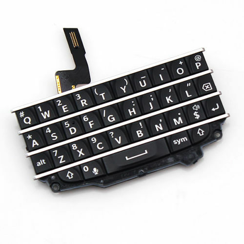

# Eagle Library For BM14B(0.8)-24DS-0.4V Component #

Special thanks to JoeN for identifying the component [here](https://forum.arduino.cc/index.php?topic=355709.0)
  

Can be used with [Blackberry Q10 keyboards](bm14b(0.8)-24ds-0.4v(53)) available on ebay

